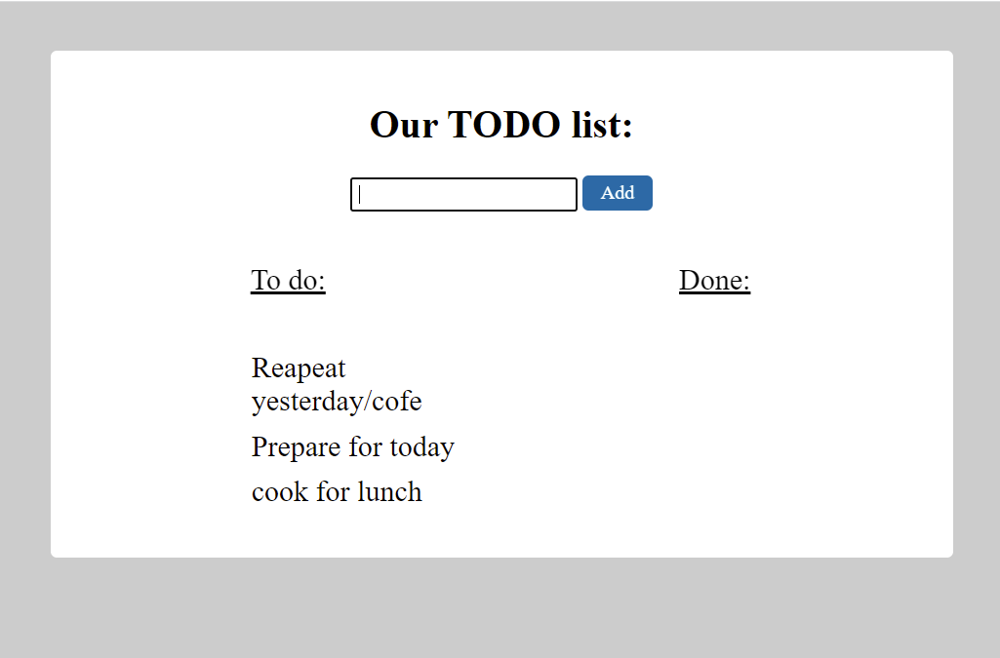
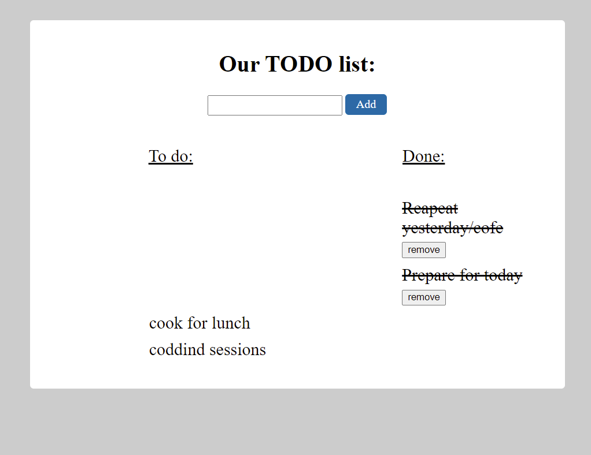

#  :point_right: Jquery-ToDoApp :heavy_check_mark:
> This To Do App creates you a basic useful list. You can add a ToDo, move it to "Done" side, and delete it.

## Table of contents
  - [Table of contents](#table-of-contents)
  - [General info](#general-info)
  - [Technologies](#technologies)
  - [Features](#features)
  - [How to use](#how-to-use)
  - [Screenshots](#screenshots)
  - [Contact](#contact)

## General info
This project is a basic application. It is created to sharpen the knowledge of jQuery Library of JavaScript. It is a part of Projects of The Clarusway IT School - Fullstack Developer Path.

## Technologies
* HTML / CSS
* jQuery-3.6.0

## Features
* Gives the input field for addint ToDo and a button for that in main appearence
* Write your item, add them, move them to "Done", and delete them...

## How to use
Click on the [link](https://i-bilge.github.io/Jquery-ToDoApp/)

## Screenshots

## Contact
:mailbox_with_mail: You can send me email : iismailbilge@gmail.com :mailbox_with_mail:
